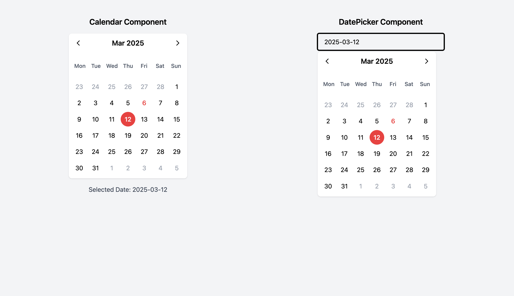

# Calendar-home-assessment

> This project is a modified and optimized version of my own open-source project [Calendar-example](https://github.com/ahwei/Calendar-example), submitted as an interview assignment.

## Project Description



This calendar application interview assignment utilizes several packages and best practices I've recently developed and worked with:

- React 18's latest features with TypeScript for enhanced type safety
- Tailwind CSS for modern UI design implementation
- Integration of dayjs for optimized date handling logic
- React Router for more effective routing management
- Comprehensive unit test coverage

## Setup and Run

1. Install dependencies:
   ```
   npm install
   ```
   or with pnpm:
   ```
   pnpm install
   ```

2. Start development server:
   ```
   npm run dev
   ```
   or with pnpm:
   ```
   pnpm dev
   ```

3. Build the project:
   ```
   npm run build
   ```
   or with pnpm:
   ```
   pnpm build
   ```

4. Preview production build:
   ```
   npm run preview
   ```
   or with pnpm:
   ```
   pnpm preview
   ```

5. Run tests:
   ```
   npm run test
   ```
   or with pnpm:
   ```
   pnpm test
   ```

## Git Commit Guidelines

This project follows structured git commit message principles:

- `feat`: New features
- `fix`: Bug fixes
- `refactor`: Code refactoring
- `style`: Style adjustments
- `test`: Test-related changes
- `docs`: Documentation updates
- `chore`: Changes to build process or auxiliary tools

Each commit includes a clear message explaining the changes, making development progress easy to track.